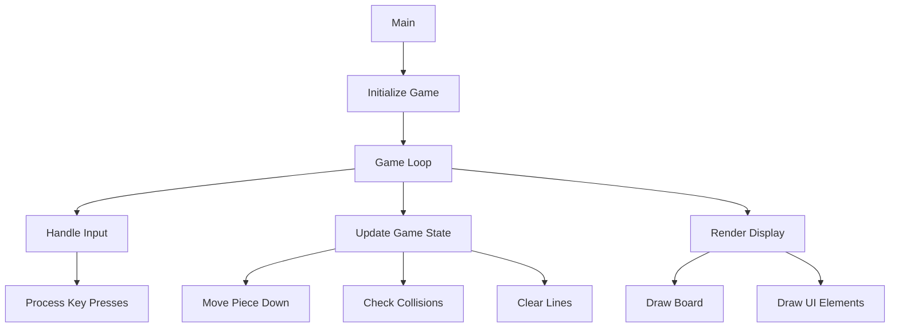

# 🎮 Tetris Console Game - Classic Block Puzzle


A faithful recreation of the classic Tetris game built for Windows console using modern C++ with authentic gameplay mechanics and colorful console graphics.

## 🌟 Features

| Feature                | Implementation Details |
|------------------------|-----------------------|
| 🧩 All 7 Tetrominoes | I, O, T, L, J, S, Z pieces with proper shapes |
| 🔄 Rotation System | Wall kicks and proper collision detection |
| ⏱️ Dynamic Difficulty | 4 speed levels with progressive difficulty |
| 📊 Scoring System | Line clears with level multipliers |
| 🎨 Colorful UI | 16-color console output with proper rendering |
| ⏯️ Game Mechanics | Hold piece, next piece preview, hard drop |

## 🛠️ Installation & Running

### Requirements
- Windows OS
- C++17 compatible compiler (MSVC/GCC/MinGW)

### Compilation
```bash
g++ tetris.cpp -o tetris -O2 -std=c++17
```

### Execution
```bash
./tetris
```

## 🎮 Game Controls

| Key          | Action               |
|--------------|----------------------|
| ← →         | Move horizontally    |
| ↑           | Rotate clockwise     |
| ↓           | Soft drop            |
| Space       | Hard drop (instant)  |
| C           | Hold/swap piece      |
| ESC         | Quit game            |

## 📊 Game Architecture



## 🧩 Core Functions Explained

### 1. Game Initialization
```cpp
Game(int diff) : difficulty(diff) {
    speed = INITIAL_SPEEDS[difficulty-1];
    srand(time(0));
    next = getRandomTetromino();
    spawnNewPiece();
}
```
- Sets initial game speed based on difficulty
- Seeds random number generator
- Prepares first pieces

### 2. Collision Detection
```cpp
bool isValidPosition(const vector<vector<int>>& shape, int x, int y) {
    for (int i = 0; i < shape.size(); i++) {
        for (int j = 0; j < shape[i].size(); j++) {
            if (shape[i][j]) {
                int newX = x + j;
                int newY = y + i;
                if (newX < 0 || newX >= WIDTH || newY >= HEIGHT || 
                   (newY >= 0 && board[newY][newX])) {
                    return false;
                }
            }
        }
    }
    return true;
}
```
- Checks if piece can be placed at (x,y)
- Verifies board boundaries and filled blocks

### 3. Rotation with Wall Kicks
```cpp
void rotatePiece() {
    // Create rotated matrix
    vector<vector<int>> rotated(current.shape[0].size(), 
                       vector<int>(current.shape.size()));
    
    // Matrix rotation logic
    for (int i = 0; i < current.shape.size(); i++) {
        for (int j = 0; j < current.shape[i].size(); j++) {
            rotated[j][current.shape.size()-1-i] = current.shape[i][j];
        }
    }
    
    // Try wall kick offsets
    for (const auto& kick : current.wallKicks) {
        if (isValidPosition(rotated, current.x + kick.x, current.y + kick.y)) {
            current.shape = rotated;
            current.x += kick.x;
            current.y += kick.y;
            return;
        }
    }
}
```

### 4. Line Clearing Logic
```cpp
void lockPiece() {
    // Add piece to board
    for (int i = 0; i < current.shape.size(); i++) {
        for (int j = 0; j < current.shape[i].size(); j++) {
            if (current.shape[i][j] && (current.y + i) >= 0) {
                board[current.y + i][current.x + j] = current.color;
            }
        }
    }
    
    // Check for complete lines
    int lines = 0;
    for (int i = HEIGHT - 1; i >= 0; i--) {
        bool complete = true;
        for (int j = 0; j < WIDTH; j++) {
            if (!board[i][j]) { complete = false; break; }
        }
        
        if (complete) {
            // Shift lines down
            for (int k = i; k > 0; k--) {
                for (int j = 0; j < WIDTH; j++) {
                    board[k][j] = board[k-1][j];
                }
            }
            lines++;
            i++; // Re-check current line
        }
    }
    
    // Update score
    if (lines > 0) {
        score += SCORE_TABLE[lines] * level;
        linesCleared += lines;
        level = linesCleared / LEVEL_UP_LINES + 1;
        speed = max(100, INITIAL_SPEEDS[difficulty-1] - (level * 50));
    }
}
```

## 📈 Scoring System

| Lines Cleared | Base Points | Level Multiplier |
|---------------|-------------|------------------|
| 1             | 40          | × level          |
| 2             | 100         | × level          |
| 3             | 300         | × level          |
| 4 (Tetris)    | 1200        | × level          |

**Level Progression**: Every 10 lines cleared increases level

## 🎨 UI Rendering System

```cpp
void draw() {
    // Clear screen
    system("cls");
    
    // Draw game board
    for (int i = 0; i < VISIBLE_HEIGHT; i++) {
        // Draw borders
        setColor(WHITE, WHITE);
        cout << "  ";
        
        // Draw cells
        for (int j = 0; j < WIDTH; j++) {
            if (board[i][j]) {
                setColor(BLACK, board[i][j]);
                cout << "  ";
            } else {
                setColor(BLACK, BLACK);
                cout << "  ";
            }
        }
        
        // Draw UI elements
        setColor(WHITE);
        if (i == 1) cout << "  Hold:";
        if (i == 4 && !hold.shape.empty()) {
            setColor(BLACK, hold.color);
            for (int j = 0; j < hold.shape[0].size(); j++) cout << "  ";
        }
    }
}
```

## 🏆 Difficulty Levels

| Level | Initial Speed | Description       |
|-------|---------------|-------------------|
| 1     | 1000ms        | Easy (Slow)       |
| 2     | 800ms         | Medium            |
| 3     | 600ms         | Hard              |
| 4     | 400ms         | Expert (Very Fast)|

## 🚀 Future Enhancements

- [ ] High score system with file persistence
- [ ] Pause game functionality
- [ ] Animated line clear effects
- [ ] Sound effects and music
- [ ] Game menu system
- [ ] Ghost piece preview

## 🤝 Contributing

1. Fork the repository
2. Create your feature branch (`git checkout -b feature/NewFeature`)
3. Commit your changes (`git commit -m 'Add NewFeature'`)
4. Push to the branch (`git push origin feature/NewFeature`)
5. Open a pull request

## 📜 License

MIT License - Free for modification and distribution

---

**Enjoy the game!** 🎮
```
